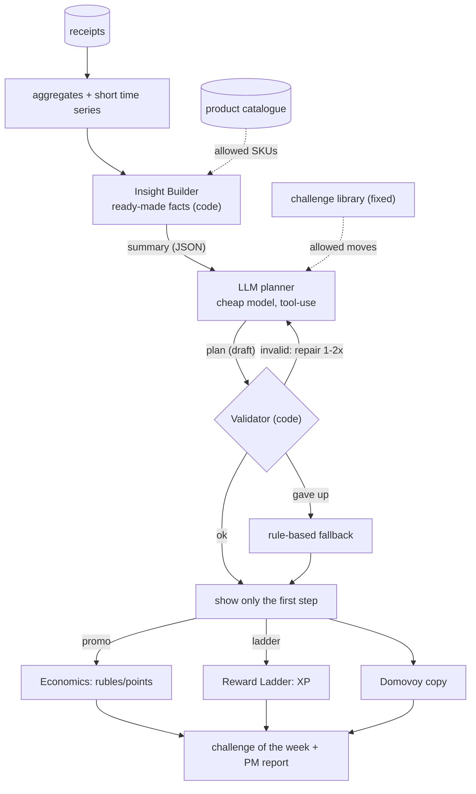
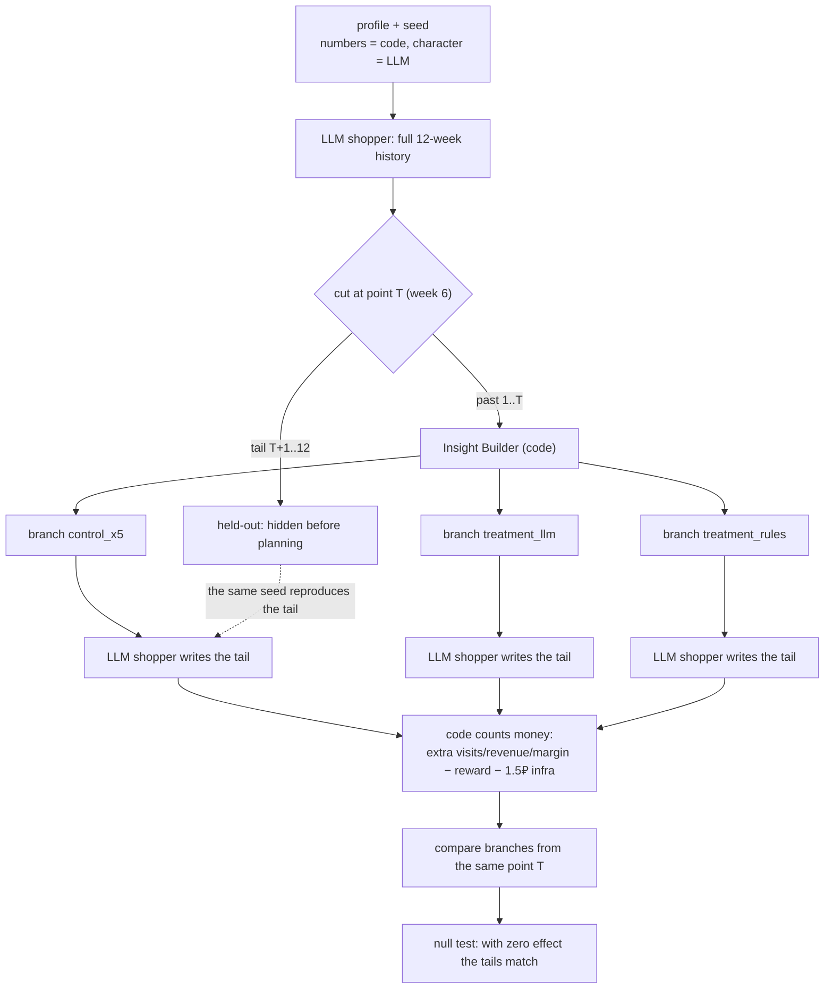

# The Domovoy ML Planner, Explained (start here)

> This is a plain-language walkthrough of the entire ML side of Domovoy. It is an on-ramp, not
> a replacement for the precise design documents (`ml-solution-architecture.md`,
> `product-and-architecture-modifications.md`, `actor-and-tracing.md`,
> `metrics-explained.md`); it exists to get you into them. Read it top to bottom: the big
> picture first, then a deep dive per component. No prior knowledge is assumed — every term is
> explained the first time it appears.
>
> Every number in the examples is a simulation assumption, not a real X5 figure.

---

## Part 0. A short glossary

Read this once and the rest is easy.

| Term | What it means, plainly |
|---|---|
| **LLM** (large language model) | The same kind of AI as ChatGPT: it reads text and answers in text. |
| **SKU** (stock keeping unit) | One specific product on the shelf — "Prostokvashino milk 3.2%, 930 ml" — not the abstract "dairy" category. |
| **Category** | A broad group of products: dairy, bakery, snacks. We use twelve of them. |
| **Baseline** | What would have happened anyway — a person's usual behaviour, or the store's ordinary mass promotion. The reference point every comparison is measured against. |
| **Margin** | The store's profit on a sale after the cost of goods, not the whole revenue. A 600 ₽ basket might carry roughly 90 ₽ of margin. |
| **Promo** | A cash reward: a discount or points. It costs the business money. |
| **XP / level** | Game experience points and levels (L1–L10), as in a video game. XP costs nothing. |
| **Churn** | The risk that a person stops visiting the store and drifts away. |
| **Challenge** | A personal task for the player: "visit three times this week", "buy these two items together". Complete it, and you earn a reward and progress. |
| **Structured output** | A mode in which the model must answer in a fixed shape — like filling in a form field by field — rather than as free text. |
| **Tool-use** | The mechanism that forces that fixed shape: the model is given a "tool" with a described schema and required to call it. With Anthropic this is the only reliable way to get structured output. |
| **Fallback** | The backup path. If the model fails or answers badly, plain rule-based code takes over and the product keeps working. |

Three more terms — **counterfactual**, **held-out**, and **uplift** — are introduced where they
are first needed, in the evaluation and metrics parts.

---

## Part 1. The big picture

### 1.1. The business problem

X5 has a large group of shoppers — the "regular middle" — who visit three to seven times a
month. We want them to visit more often, without handing out discounts across the board.

The idea: a personal challenge from the model brings a shopper back before a deadline, and we
pay a reward only for the extra visit that would not have happened without us. If the person
would have come anyway, we spend nothing.

The headline result we aim for: the share of shoppers who make at least N purchases in four
weeks (working hypothesis: eight) should rise by two percentage points against shoppers who
received nothing personal.

### 1.2. What we propose, in two sentences

A cheap LLM acts as an analyst. It reads a summary that the code prepares about one person, and
plans that person's next challenge — chosen from a fixed library of tasks over a fixed
catalogue of products, and returned in a strict shape (structured output via tool-use).

### 1.3. The one rule that never bends: the model never computes money

This is the product's hard line, and it holds everywhere:

- **The model never sets rubles or XP.** It picks only the *form* of a reward and its *strength
  step* — none, low, medium, or high. How much that is in rubles or points is computed by
  deterministic code, from margin and from the player's level.
- **The model never invents products.** It may reference only products from the catalogue, and
  the code checks every reference.
- **The model never fabricates numbers.** Every fact — purchase rhythm, churn risk, baseline —
  is computed by code and handed over ready-made. The model is left the *choice of move*, not
  the arithmetic.

The reason is simple: a strict answer shape guarantees the *form* of the answer, never its
*truth*. The less grounding a model is given, the more readily it invents a plausible-looking
number. So the numbers live in code, and the model is left only the decision of what to offer.

### 1.4. Who decides what: the model versus the code

| The **LLM planner** decides | The **code** decides, deterministically |
|---|---|
| Which challenge to give: type, target, which products | Whether those products exist and the target is sane |
| The reward form: `promo`, `ladder`, or `none` | How many rubles that is (Economics) |
| The reward strength step: none, low, medium, or high | How much XP that is (Reward Ladder) |
| A plan a step or two ahead (`steps[]`) | How many steps are active at once (exactly one) |
| Whether to change strategy after a move fails | The safety copy, anti-fraud, and week boundaries |

Keep this table in mind — the rest of the document simply unfolds it, piece by piece.

---

## Part 2. How it works, end to end

Here is what happens, step by step, from the moment a person leaves the store.

1. **The code gathers facts.** From receipts it computes aggregates and a short time series per
   category: how often the person visits, how recently, and at what rhythm. This is the job of
   the **Insight Builder**.
2. **The model plans a move.** The summary, the list of allowed challenge types, and the product
   catalogue go to the **planner**, which returns a plan in the strict shape.
3. **The code checks the plan (Validator).** Do the products exist? Is the target within a sane
   range? If something is off, the model is asked to repair it — one or two attempts — and if
   that fails, the rule-based fallback takes over.
4. **The code computes the reward.** For a cash reward (`promo`), **Economics** computes the
   amount. For experience (`ladder`), the **Reward Ladder** computes the points. For `none`,
   there is no reward — the challenge is worthwhile on its own.
5. **The person sees exactly one task** — the first step of the plan — with a clear explanation
   of why it is for them.

The same flow as a diagram:



The key point: the model takes part only in the middle block — summary, plan, check. Everything
that touches money, experience, or copy lives in a separate, predictable module.

---

## Part 3. Component deep dives

### 3.A. The fixed SKU catalogue

For challenges to be about concrete products rather than abstract categories, we need a fixed
list of products that the model only *chooses* from — it never invents them.

- For the hackathon this is 200 to 500 products: fifteen to forty per category across the twelve
  categories, with synthetic but plausible prices.
- It lives in a new table, `sku_catalog`. Each product has a stable `sku_id` (this is exactly
  what the model returns), a name, a category, a price, a typical discount depth, an
  eligibility flag for whether it may appear in a challenge (alcohol and tobacco may not), and a
  popularity rank.
- The rule: any product in the model's answer must exist in the catalogue and be eligible.
  Otherwise the plan goes to repair, or to the fallback.

The fixed catalogue is the technical guarantee that the model can never offer a product that
does not exist.

### 3.B. The Insight Builder

Between the raw data and the model sits code that turns purchase history into a compact JSON
summary. It also ensures that names and addresses never reach the model.

By default it sends derived features rather than raw receipts. Here is what they mean:

| Feature | In plain words | Example |
|---|---|---|
| `frequency_per_week` | how often the person visits | `1.8` ≈ twice a week |
| `recency_days` | days since the last purchase | `11` = nearly two weeks quiet |
| `avg_basket` | average basket, ₽ | `590` ₽ per trip |
| `cadence_days` | the usual gap between purchases | `5.5` = roughly every five to six days |
| `days_overdue` | how far past their own rhythm the person is | `5` = five days quieter than usual |
| `promo_sensitivity` | how strongly they react to discounts, 0 to 1 | `0.32` = low to medium |
| `category_affinity` | favourite categories (share, visits, rhythm) | dairy = 22% of receipts |
| `churn_risk` | risk of leaving: none, elevated, or high | `elevated` = starting to drift |
| `level` / `tenure_weeks` | in-game level and time in the product | `L3`, 7 weeks |

The strongest early-churn signal is when `recency_days` runs well past the usual `cadence_days`
— that is, `days_overdue > 0`: the person should have visited but did not. That is exactly the
signal the planner tries to act on.

### 3.C. The LLM challenge planner

**The model's role.** "You are a loyalty-programme analyst. Here is a summary of one person, a
list of allowed challenge types, and a product catalogue. Choose one next challenge that brings
this person back before a deadline, and fill in the form. You do not set rubles, points, or XP —
only the reward form and its strength step."

**How the strict answer is obtained (an important Anthropic detail).** Anthropic has no separate
"answer strictly in this schema" switch. The working equivalent is forced tool-use: we declare a
tool, `emit_challenge_plan`, with every field described, and require the model to call exactly
that tool. From then on the model must return arguments that match the shape.

**The model returns a plan of steps (`steps[]`).** A plan is an array of steps — at most two for
now (`MAX_PLAN_STEPS = 2`). Each step stands on its own: its own type, target, products, reward
form, and reward step.

The key nuance is what the person sees. Only the first step (`steps[0]`) is shown — the "hero of
the week". The second step (`steps[1]`) is never shown to the person. It exists for two reasons:

- as an internal note — "what to give next week" — which goes into the PM report and is fed back
  into the planner's next call;
- as a promise hook for bundles such as "buy this now, get a discount on your favourite later".

There is no separate "unlocks the next step" flag: if a plan has a second step, then that is
what is planned after the first. Even so, next week's hero is planned afresh, and `steps[1]` acts
as a strong hint for it rather than a hard-wired offer. This is how we keep the product rule that
exactly one set of tasks is active per week.

**The planner's memory (`previous_plans`).** The model receives one to three of its past moves,
each with a status — `completed`, `expired`, or `active` — and whether it was used. If a past
challenge did not work (it expired, or was left untouched), the model changes strategy rather
than repeating it.

**Cost.** One call to a cheap model per person per week, or per "after a visit" event — not per
request. There is an eight-second timeout, one attempt plus a repair, then the fallback.

The answer shape, simplified:

```jsonc
{
  "steps": [                 // 1..2 steps; the person sees only steps[0]
    {
      "challenge_type": "frequency | category | basket | streak | replenishment | collection",
      "target": 3,           // weekly target; code checks the corridor against baseline
      "category": "dairy",   // one of the twelve categories, or null
      "sku_refs": ["SKU-00123"],       // 0..3 products, strictly from the catalogue
      "reward_kind": "promo | ladder | none",   // reward form
      "reward_level": "none | low | medium | high", // strength step; the amount is code's job
      "deadline_days": 7
    }
  ],
  "insight_used": ["recency_days", "cadence_days"], // which facts were actually used
  "rationale": "…"           // justification; must contain a number from the summary
}
```

What the answer cannot contain — because it is the code's job — is promo rubles and points, XP
amounts, and any new or non-existent product.

### 3.D. The challenge library

The model picks a challenge type only from a closed list. Each type is a simple check over
receipts ("done" or "not done") plus a clear behavioural hook — the reason a person would want to
do it:

| Type | What it checks | Why it pulls | Worthwhile without promo? |
|---|---|---|---|
| `frequency` | +N visits over the personal baseline in a week | a goal drawn from the person's own habit; the deadline nudges | sometimes |
| `category` | N purchases in a category | deepen a favourite or open a new one | sometimes |
| `basket` | assemble a bundle of two or three items in one receipt | "cheaper together"; the bundle beats a flat discount | often |
| `streak` | do not break a run of active weeks | losing a streak hurts more than the matching gain | yes (game-like) |
| `replenishment` | restock a staple before the personal rhythm runs out | a reminder before the milk runs out | sometimes |
| `collection` | close a set across K different categories | the pull to finish what was started | yes (game / discovery) |

Three decisions are worth noting:

- A new type is data plus one check, not a rewrite of the recommender.
- Win-back — bringing back a fading shopper — is a goal, not a type. Any of the types above can
  serve it, chosen against the `churn_risk` signal and paired with a stronger reward. There is no
  `winback` type; it is spread across the choice of mechanic, `churn_risk`, and reward step.
- Random rewards — a lottery, a mystery box — are deliberately absent. They would break the rule
  that rewards are predictable. Every hook is deterministic.

### 3.E. The Economics / budget engine (money)

The engine receives the reward form (`reward_kind`) and the strength step (`reward_level`) from
the plan, and computes money from margin. The formula is already implemented:

```
expected extra purchases = target − baseline
expected extra revenue   = × average basket
expected extra margin    = × contribution margin (0.15)
max reward, ₽            = × 0.40        # never more than 40% of the effect
points                   = round down to a multiple of 10, min 30, max 150
```

The reference example reproduces exactly: baseline 2, target 3, a 600 ₽ basket, a 90 ₽ margin, a
36 ₽ budget, and 30 points.

**Strength step to share of budget.** The model says how large the reward should be; the code
turns that into money inside the cap:

| `reward_level` | share of the max | when it is chosen |
|---|---:|---|
| `none` | 0% | the challenge is worthwhile on its own |
| `low` | ~40% | the person is stable; a light nudge |
| `medium` | ~70% | signs of slowing down |
| `high` | 100% (= the current cap) | early churn |

The key safeguard: even `high` never breaks margin — the cap is always 40% of expected extra
margin. This is exactly the split the product owner asked for: the model decides "medium or
high", the code decides "how many rubles".

**Who gets a stronger promo.** Stable shoppers get `ladder` or `none`/`low`; at churn risk
(`elevated` or `high`) the step rises to `medium`/`high`. This is a threshold on `churn_risk` and
`promo_sensitivity`, not a complex model — deliberately, for explainability and for the timeline.

**Budget** is a simple per-person cap (`max_reward_rub`, already margin-safe) plus a "spend
versus extra margin" report. There are no elaborate budget optimizers in the hackathon.

### 3.F. The Reward Ladder (experience)

The second retention lever needs no money: it works through accumulated experience. The idea is
"after enough experience, a coupon or a higher in-app discount", along with the motivation to
save XP toward the next reward on the ladder.

- `reward_kind=ladder` does not create a new currency. It is bonus XP on top of the normal
  `XP_CHALLENGE` (+50 for a completed challenge), flowing into the same L1–L10 levels.
- The model chooses only the strength step (`low`, `medium`, or `high`); the code computes the XP
  amount from the player's grade:

```
ladder_bonus_xp = LADDER_STAGE_BASE_XP[reward_level] × grade_multiplier(level, tenure_weeks)
```

- `LADDER_STAGE_BASE_XP = {none: 0, low: 10, medium: 20, high: 30}` — the base add-on per step,
  on top of the +50.
- `grade_multiplier` decreases from newcomer to veteran: for the same step, a newcomer earns
  noticeably more XP. This is the "give newcomers more" rule, and it is deterministic.

The boundary is the same as with money: the model chooses the reward *form*, the code always
computes the *amount*.

### 3.G. Evaluation without real users

We have no real user data, so we test quality synthetically. Three terms are needed here:

- **Counterfactual** — "what would have happened if…". We compare the same person across parallel
  worlds: in one they got our challenge, in another the ordinary promotion.
- **Held-out** — set aside. We hide part of the future from the planner so it cannot peek at the
  answer.
- **LLM-as-judge** — letting a model rate "good" or "bad". We deliberately do not use it; instead
  of an opinion we count behaviour and money.

How the test works — this is the core of the evaluation:

1. **Full history.** An LLM playing the shopper generates the whole history over the horizon, say
   twelve weeks: visits, receipts, and products.
2. **Cut at point T.** We take the history up to week T (say six) as "the past". The tail after T
   is hidden (held-out).
3. **Intervention at T.** The code computes the summary over "the past", and the planner issues a
   challenge.
4. **Continuation.** The same LLM shopper writes the rest of the tail — weeks seven to twelve —
   with the offer in context: did they come earlier, top up the basket, complete the task?
5. **Scoring, by code.** From the written tail the code computes revenue and extra margin, and
   subtracts the reward cost. No judge — only generated receipts and arithmetic.

We compare three branches of the same person from the same point T:

- **`control_x5`** — the ordinary X5 mass promotion (10% cashback on the basket, no
  personalization). This is the baseline: how it would go without us.
- **`treatment_llm`** — our LLM planner.
- **`treatment_rules`** — the same challenge, but chosen by simple rules without an LLM. This is
  a fair "cheap competitor" that separates the value of the model from the value of the challenge
  mechanic itself.

The evaluation cycle:



Two safeguards keep us honest, both without a judge:

- **The null test.** If a person ignores the offer entirely, their behaviour does not change — so
  all three branches must produce the same tail, the measured lift is zero, and `net_effect ≤ 0`.
  Any lift can come only from the offer, never from chance. It runs offline: `run-eval --null
  --no-llm`.
- **No peeking at the future.** The tail after T is hidden before planning, and a fixed `--seed`
  reproduces it exactly. The planner never sees the tail it is later judged on.

---

## Part 4. The synthetic shopper (actor) and traces

### 4.1. The failure mode: an eager-to-please actor

The actor is an LLM playing a shopper. Left to its defaults, a model behaves like a helpful
assistant and agrees "to be useful". An agreeable actor completes even irrelevant challenges —
one early configuration reached a completion rate near 0.98 at a relevance near 0.28. That
inflates promo usage and makes the result dishonest. The cause is not the economics; it is the
prompt.

### 4.2. How we make the actor behave like a real person

We steer the actor to be self-interested and inert, the way a real shopper is:

- **A firm first-person role:** "You are this shopper. Not an assistant, not a fan of the store."
- **Change nothing by default:** we spell out `buy_as_usual` (I buy as usual) and `ignore` (not
  relevant); most offers are noise.
- **No debt to the store:** "You owe the store nothing and gain nothing by being agreeable."
- **A personal bar:** the actor may accept (`use_offer`) only if the offer clears this shopper's
  own bar — relevance to their purchases, the effort of extra trips, and the reward's worth given
  their attitude to deals.
- **Think first, decide second:** the answer shape forces `thinking` to be filled in before the
  verdict, so the model does not reflexively say "yes".
- **Different models for actor and planner:** a strong model (DeepSeek) plays the shopper, a
  cheap one (Qwen) picks the rewards, so no single network grades its own work.

The actor's strict answer:

| Field | Meaning |
|---|---|
| `thinking` | reasoning from the shopper's point of view; comes first, forcing thought before the decision |
| `promo_decision` | the verdict: `use_offer`, `buy_as_usual`, or `ignore` |
| `extra_visits` | extra visits caused only by the offer; zero unless `use_offer` |
| `completed_challenge` | whether the goal was reached by the deadline |
| `rationale` | one sentence justifying the verdict |

One detail: `engaged` is no longer a model field but a computed one — `promo_decision ==
"use_offer"`. The model cannot switch "engaged" on behind the verdict's back.

### 4.3. Peaky profiles

To make shoppers distinct and characterful, the code gives each one:

- `archetype` and `persona_brief` — a living role: a creature of habit, a thrifty student, a
  departing customer;
- `deal_attitude` — `promo_skeptic`, `selective`, or `deal_seeker` — skewed toward skeptics, so
  the sample is guaranteed to hold many hard-to-please shoppers;
- `routine_rigidity` — how rigid the routine is; the higher it is, the less willing the shopper
  is to make extra trips;
- `favorite_categories` — the top three categories, so the actor judges relevance itself.

Profiles are deterministic under `--seed`, so they are reproducible.

### 4.4. Traces and Langfuse

So that we can verify the model is not cheating, each profile is traced: a snapshot of the
shopper, every planner attempt, and — per branch — the actor's decision alongside the raw LLM
answer and the parsed JSON, side by side.

- `run-eval --trace-out build/eval_traces.jsonl` writes line-delimited JSONL: line one is the run
  header, then one line per profile. `build/` is in `.gitignore`, so traces are not committed.
- `export-traces --to json` produces a flat view for inspection.
- `export-traces --to langfuse` uploads to a self-hosted Langfuse — an open-source tool for
  viewing LLM traces, run locally via docker. One profile becomes one trace; each LLM call
  becomes one generation with metadata.

### 4.5. On simulation length

Today the actor scores the whole tail (six weeks) in a single call per branch. We could replay
it week by week, with the actor deciding each week separately, but that is twelve times the
calls: for fifty profiles across three branches over twelve weeks, it is 1,800 calls instead of
150, plus accumulating error. So the default is the cheap single-shot tail; a week-by-week mode
belongs behind a separate flag for a specific question. We do not build it in this iteration.

---

## Part 5. Metrics

One last term: **uplift** — how much better our branch is than the control, measured in
percentage points (pp).

The metrics fall into two groups.

### 5.1. Business metrics: does it make money?

Units are rubles per shopper over the tail after point T, unless stated otherwise.

- **incr.visits** — how many extra store trips happened solely because of the offer. This is the
  primary signal: are we bringing the person in more often, or not?
- **incr.margin** — how much extra margin (profit, not revenue) those extra visits produced.
- **reward cost** — how much we spent on the reward. Promo costs money; `ladder` and `none` cost
  nothing.
- **net_effect** = `incr.margin − reward cost − infrastructure`. This is the net profit from our
  intervention, and it is what we ultimately optimize.
- **biz-metric share** — the share of shoppers who made at least eight purchases in four weeks (a
  "healthy active shopper"). This is a threshold: a small gain in visits does not always carry a
  person across the line.
- **uplift** — how much higher that share is in our branch than in the control (`treatment_llm −
  control_x5`), in pp. It moves sluggishly precisely because it sits on a threshold; for fine
  sensitivity, prefer the continuous `net_effect` and `incr.visits`.

### 5.2. System metrics: does the mechanic work as intended?

These are shares from 0 to 1.

- **completion** — the share of shoppers who carried a challenge to the end. A low value means
  the goals are too hard or irrelevant.
- **relevance hit** — the share of offers that hit a real need: a win-back for a departing
  shopper, or a long-unbought category. It is computed by code from the summary, not by the
  model's opinion.
- **llm plans** — the share of plans that came from the LLM rather than the emergency fallback.
  If the planner often returns something invalid, this share drops.

### 5.3. What we optimize, by priority

1. **net_effect per person** — whether we earn after rewards and infrastructure. The main goal.
2. **incr.visits** — whether we bring the person in more often, which is the source of margin.
3. **completion and relevance hit** — whether the challenges are meaningful, achievable, and
   timely.
4. **biz-metric share and uplift** — a coarse business headline for the PM; useful as a title,
   but less sensitive than the rest.

`reward cost` and `llm plans` are not goals but constraints: a reward must pay for itself, and
the LLM-plan share must stay high, or the planner adds nothing over the rules.

### 5.4. Reading the current report

From `eval-report.md` (seed 7, fifty profiles): `treatment_llm` shows a net_effect of 1.68 ₽,
against 0.0 for the control and 0.96 for the rules; a relevance hit of 0.96, against 0.26 for the
rules; and an llm-plan share of 0.94. The LLM branch is both more profitable and markedly more
relevant than the cheap rules. Meanwhile the uplift on the eight-purchase threshold is 0.0 pp —
exactly the "the threshold did not move" case, even though the continuous metrics rose.

---

## Part 6. Open questions

- Do we give the model the raw last ten receipts, or only derived features? The default is
  features.
- `reward_level` to share of budget: fix it with a table (0 / 40 / 70 / 100%), or calibrate it by
  simulation?
- Reward ladder: the concrete thresholds, the decay shape, the coupon ceiling, and how much XP a
  `ladder` challenge grants.
- `reward_kind`: do we let the model choose `ladder` versus `promo`, or is it a hard rule by
  segment or churn?
- `MAX_PLAN_STEPS`: fix it at two for the hackathon, or open it to three?
- Catalogue: scrape real X5 products, or use a synthetic, plausible set?
- Catalogue in the model's context: for the hackathon we pass the whole catalogue; in production
  it will not fit and will need relevance-based retrieval. Where is the crossover point?
- The history horizon for evaluation (twelve weeks?) and the cut point T (the middle?): fix them,
  or sweep them.

---

## Where to go next

- The precise target architecture, with every contract — `ml-solution-architecture.md`.
- What the rework changes in the accepted product — `product-and-architecture-modifications.md`.
- The synthetic shopper and traces in detail — `actor-and-tracing.md`.
- The metrics with formulas and invariants — `metrics-explained.md`.
- The latest run, with numbers — `eval-report.md`.
