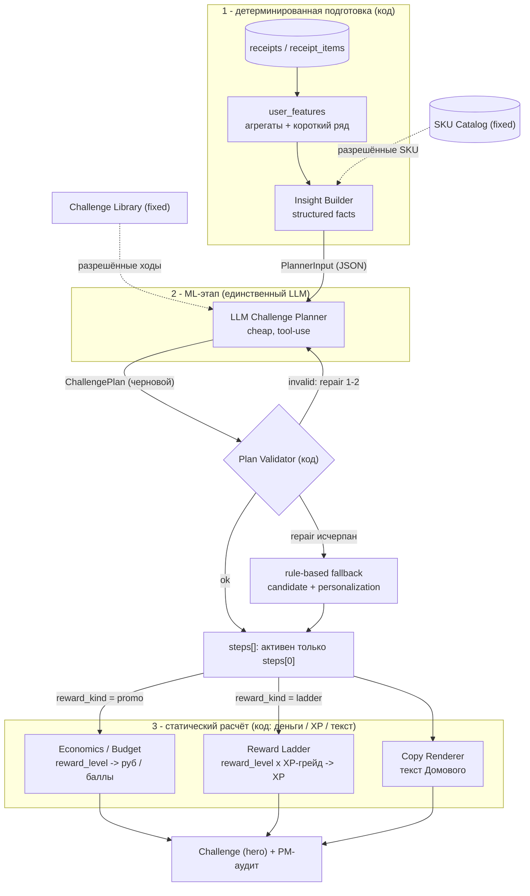
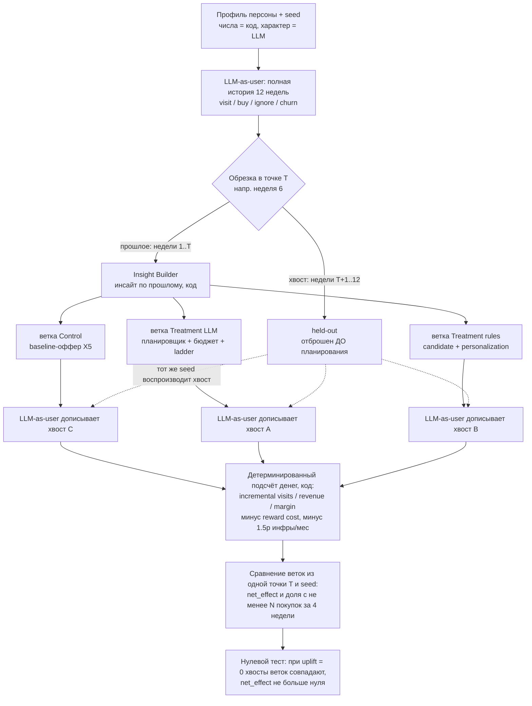
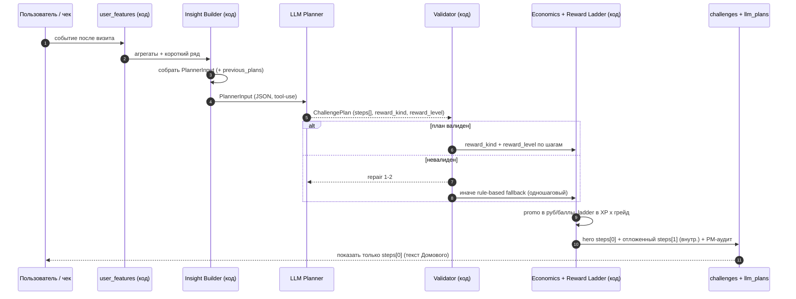

# ML-архитектура «Домовой»: LLM-планировщик персональных челленджей

> Статус: **принято, смёрджено в продукт и backlog** (product-owner sign-off). Карта влияния на уже
> зафиксированную архитектуру и продукт — в
> [product-and-architecture-modifications.md](product-and-architecture-modifications.md);
> синхронизация задач — эпик [E14](../../dev/docs/backlog/E14-ml-planner.md).
> Все числовые параметры — `simulation assumptions`, а не показатели X5.

## Бизнес-суть: что даём и как награждаем

Три вопроса, на которые этот документ отвечает в первую очередь — **зачем это бизнесу**, **что получает
пользователь** и **как мы его награждаем**. Всё остальное ниже — как это устроено технически.

### Бизнес-эффект (зачем X5)
Мы поднимаем **частоту покупок** «регулярного середняка» (3–7 покупок/мес) на своём же магазине, **не разменивая
маржу на скидки**. Персональный челлендж от ИИ возвращает человека в магазин до дедлайна, а награда платится
только за инкремент, которого без нас не было бы.

- **Главная метрика:** доля пользователей с **≥ N покупками за 4 недели**, Test vs Control, цель **+2 п.п.**
- **Юнит-экономика:** `net_effect = incremental margin − reward cost − 1.5 ₽ инфры/мес`; принимаем ход, только
  если `net_effect > 0` на продолжении истории (eval §9, без LLM-судьи).
- **Жёсткий guardrail маржи:** денежная награда ≤ `40% × ожидаемой инкрементальной маржи` челленджа —
  даже стадия `high` (`PROMO_LEVEL_SHARE=1.0`) упирается ровно в этот потолок, а `reward_kind=ladder`/`none`
  не тратят промо-бюджет вовсе. Недельный потолок награды — 150 баллов, применяется пошагово.

### Что даём пользователю
Ценность, ради которой человек открывает приложение между покупками, — в основном **бесплатная** (персонаж,
прогресс, лига), а деньги идут точечно:

- **Один персональный челлендж недели** (hero) от ИИ-планировщика — измеримый по чекам, всегда выше личной
  базы, с объяснением «почему это мне». На главном видно ровно один следующий шаг (`steps[0]`).
- **Персонаж «Домовой»** — уровень/XP, настроение (food-to-mood по корзине), стрик недель без пропуска,
  косметика за прогресс. Даёт ежедневную причину вернуться без скидок.
- **Счётчик экономии, «Лига дома» (анонимный рейтинг соседей по любимому магазину) и реферал** — социальный
  и накопительный контур, тоже без денежной раздачи.

### Как награждаем (форму выбирает ИИ, сумму — код)
Планировщик выбирает только **форму** и **ординальную стадию** награды; конкретные рубли/XP считает
детерминированный код — деньги LLM не назначает (сохраняем принцип продукта, decision #7/#14):

| `reward_kind` | что получает пользователь | кто считает величину |
|---|---|---|
| `promo` | скидка/баллы против бюджета маржи | Economics Engine: `reward_level` → доля от `40% × margin` |
| `ladder` | бонус-XP в ту же шкалу уровней L1..L10 (ближе к следующему подарку) | Reward Ladder: `стадия × грейд пользователя` |
| `none` | самоценный челлендж (интересная связка товаров) без промо | — (бюджет не тратится) |

LLM задаёт лишь стадию `reward_level` (`none/low/medium/high` — «насколько крупно»), а «сколько именно рублей
или XP» — статические модули по марже и по грейду. Награды детерминированы, случайных призов нет.

## 0. TL;DR

Сегодня выбор челленджа — это hand-rolled рекоммендер: `candidate.build` (правила headroom/affinity)
→ `personalization.rank` (формула priority). LLM в текущем коде отвечает только за текст и в
`app/llm/domovoy_copy.py` пока вообще заглушка-шаблон (см. `dev/backend/app/features/challenges/candidate.py`,
`dev/backend/app/features/challenges/personalization.py`, `dev/backend/app/llm/domovoy_copy.py`).

Предлагается заменить рекоммендер на **дешёвую LLM в роли time-series / insight-аналитика**, которая
**планирует следующий персональный челлендж** пользователя и возвращает его строго по фиксированной
схеме (structured output) поверх **фиксированного каталога SKU**. При этом сохраняются жёсткие границы,
которые уже заложены в продукт:

- **LLM не считает деньги и не назначает XP.** Размер денежной награды (баллы/скидка в рублях) по-прежнему
  считает статический Economics Engine из истории покупок и маржи (`dev/backend/app/features/challenges/economics.py`,
  `dev/docs/domain-rules.md` §6). LLM выбирает только **ординальную стадию** награды `reward_level`
  (`none / low / medium / high`) — «насколько крупно», — а сколько это рублей или XP, считает статический модуль.
- **LLM не придумывает товары.** Она может ссылаться только на существующие SKU/категории из каталога;
  ссылки валидируются детерминированно.
- **LLM выбирает форму и стадию награды, но не её величину.** Планировщик решает `reward_kind` (`promo` —
  скидка/баллы против бюджета; `ladder` — очки в reward ladder; `none` — самоценный челлендж без промо) и
  стадию `reward_level`, а конкретные
  рубли/XP считают статические модули: Economics по марже, Reward Ladder — как `стадия × грейд пользователя`.
  Часть челленджей **самоценны** (интересная связка товаров) и не тратят промо-бюджет вовсе.
- **План — последовательность шагов (`steps[]`), а не один оффер.** Планировщик думает на несколько шагов
  вперёд: самоценная связка сейчас (`steps[0]`) ведёт к награде потом (`steps[1]`), напр. «купи два снека
  вместе → скидка на любимую категорию на следующей неделе». Структура плана обобщена под N шагов, но на
  хакатоне жёстко ограничена `MAX_PLAN_STEPS = 2` (одно решение LLM = максимум два шага). **Пользователю
  показывается всегда ровно один шаг — `steps[0]` (hero текущей недели)**; `steps[1]` пользователю не виден:
  это **внутренний сигнал**, который идёт в PM-аудит и на вход следующему вызову LLM, а сам следующий hero
  планируется заново (`domain-rules.md` §7: один активный набор на неделю). Отдельного флага «открывает
  следующий шаг» в схеме нет — сам факт наличия `steps[1]` и означает это. Это массив в схеме плана, а не
  отдельный движок деревьев.
- **Планировщик видит свои прошлые ходы (`previous_plans`).** На вход подаём 1–3 последних плана
  пользователя с их статусом (`completed / expired / active`) и фактом использования. Если прошлый челлендж
  не сработал (истёк, не использован), LLM меняет стратегию, а не повторяет её.

Проверяем всё это **полностью синтетической evaluation-петлёй без LLM-судьи**: LLM в роли пользователя
генерирует полную историю покупок профиля, мы **обрезаем историю на середине**, подставляем в этот момент
наш челлендж (или baseline-оффер X5), просим ту же LLM-пользователя **дописать оставшуюся историю** с
учётом оффера, и затем **детерминированно считаем выручку и маржу** по формулам продукт-овнера. Никакой
судья «нравится/не нравится» не нужен — сравниваем поведение (визиты, покупки, деньги) между ветками.

---

## 1. Почему меняем рекоммендер на LLM-аналитика

Текущий `candidate + personalization` покрывает ровно два типа целей (`frequency`, `category`) и ранжирует
их фиксированной формулой priority. Ограничения для целевого сегмента (`regular_mid`, 3–7 покупок/мес):

- **Плоская персонализация.** Priority = функция от `frequency_per_week` и `share`; два пользователя с
  похожими агрегатами получают один и тот же челлендж, хотя их временны́е паттерны (кадэнс молока,
  день недели, дрейф к оттоку) разные.
- **Нет чтения time-series.** `user_features` — это агрегаты за окно; сигнал «покупает молоко раз в 5–6
  дней, но последние 12 дней не заходил» в priority не попадает. Это ровно тот сигнал раннего оттока,
  ради которого продукт и существует.
- **Нет товарной конкретики.** Челлендж формулируется в макрокатегориях (12 штук), а привлекательный
  оффер — это конкретная корзина SKU («молоко + хлопья со скидкой»).
- **Жёсткая библиотека.** Добавить новый тип челленджа = править код `candidate.py` и формулы.

LLM-аналитик снимает эти ограничения не «магией», а тем, что читает подготовленный нами структурированный
инсайт (агрегаты + временной ряд последних чеков) и **выбирает** ход из **фиксированной** библиотеки
челленджей и **фиксированного** каталога SKU. Он не генерирует свободный текст-решение — он заполняет схему.

Дешёвую модель это выдерживает: при schema-constrained decoding маленькая модель по надёжности формата
догоняет большую (structured-output исследования 2026), поэтому «cheap LLM» — обоснованный выбор, а не
компромисс.

---

## 2. Целевая ML-архитектура (общая схема)



Ключевая идея: **LLM — только этап `Insight Builder → Planner → Validator`**. Всё, что касается денег,
наград за опыт и текста, остаётся в отдельных детерминированных/статических модулях. LLM выбирает **форму**
награды (`reward_kind`: промо-бюджет, очки в reward ladder или `none` — самоценный челлендж), а **величину** считает статический модуль —
Economics (рубли/баллы) или Reward Ladder (XP/купон). Аллокация бюджета — простой **per-user cap**, без
онлайн-оптимизаторов. Границы модулей
совпадают с текущей feature-архитектурой (`router → service → database`, pydantic между слоями).

---

## 3. Компонент A — фиксированный каталог SKU

Сейчас товаров нет, есть только 12 макрокатегорий (`game_rules.CATEGORIES`). Для товарной конкретики
нужен **фиксированный каталог SKU**, из которого LLM только выбирает (не генерирует).

### Источник данных
- **Скрейп популярных товаров X5** (Пятёрочка/Перекрёсток): название, бренд, объём/вес, регулярная цена,
  типичная промо-глубина, макрокатегория. X5 Club уже держит товарную аналитику на уровне SKU
  («сколько кг бананов купил»), поэтому product-level персонализация — это то, что платформа реально умеет,
  и наш каталог её эмулирует.
- На хакатоне — 200–500 SKU, по 15–40 на каждую из 12 макрокатегорий; синтетические, но правдоподобные цены.

### Схема (новая таблица `sku_catalog`, владелец — новая feature `catalog`)

| поле | тип | смысл |
|---|---|---|
| `sku_id` | TEXT PK | стабильный ключ, его LLM и возвращает |
| `name` | TEXT | «Молоко Простоквашино 3.2% 930мл» |
| `category` | TEXT | одна из 12 макрокатегорий (`game_rules.CATEGORIES`) |
| `brand` | TEXT NULL | |
| `regular_price` | NUMERIC(12,2) | регулярная цена за единицу |
| `typical_promo_depth` | NUMERIC(4,3) | обычная глубина скидки 0..1 |
| `is_challenge_eligible` | BOOLEAN | `false` для alcohol/tobacco (см. `CHALLENGE_EXCLUDED_CATEGORIES`) |
| `popularity_rank` | INTEGER | для приоритезации подсказок LLM |

Каталог — единственный «словарь» товаров: любой `sku_id` из ответа LLM обязан существовать в нём и быть
`is_challenge_eligible = true`, иначе plan уходит в repair/fallback.

---

## 4. Компонент B — Insight Builder (детерминированный)

Между `user_features` и LLM ставим **детерминированный сборщик инсайта**: он превращает историю в
компактный JSON, который умещается в контекст дешёвой модели и не течёт «сырыми» ФИО/адресами.

Подаём в LLM (обсуждаемо, но по умолчанию — **агрегаты + короткий ряд**, а не сырые чеки):

- **Агрегаты из `user_features`:** `frequency_per_week`, `recency_days`, `avg_basket`, `promo_sensitivity`,
  `cadence_days`, `category_affinity[]` (share/visits/cadence), `favourite_store`, `weekday_pattern`,
  `realized_savings_30d`, `challenge_history`.
- **Товарный time-series по категориям:** для 3–5 топ-категорий — «покупает молоко каждые ~5.5 дней,
  последняя покупка 11 дней назад» (кадэнс + просрочка кадэнса). Это тот самый сигнал ранней про-оттока.
- **Опционально — последние N=10 чеков** в сжатом виде (дата, магазин, сумма, топ-категории). По умолчанию
  **не подаём сырые чеки, а подаём производные признаки** — дешевле по токенам и надёжнее по приватности;
  сырые чеки включаем флагом только под A/B, если инсайтов не хватает.
- **Триггер оттока:** булев/ординальный признак `churn_risk` (например `recency_days > 1.8 × cadence_days`),
  посчитанный кодом, — чтобы LLM опиралась на явный сигнал, а не «додумывала» его.
- **Прошлые ходы планировщика (`previous_plans`):** последние 1–3 hero-плана пользователя со статусом
  (`completed / expired / active`) и фактом использования — чтобы LLM меняла стратегию, если прошлый
  челлендж не сработал (см. §5, §11). Берём из таблиц `challenges` / `llm_plans`.
- **Полный каталог eligible-SKU (`catalog`):** весь допустимый ассортимент (`sku_id`, `name`, `category`,
  `regular_price`) — а не top-N подсказка. На хакатоне каталог небольшой (200–500 SKU) и целиком помещается в
  контекст дешёвой модели, поэтому LLM видит весь выбор товаров. В проде каталог не влезет — там понадобится
  retrieval по релевантности (см. открытые вопросы).

### Признаки пользователя простыми словами
Это те самые «фичи», на которые смотрит планировщик. Ниже — что каждая значит на человеческом языке:

| признак | простыми словами | пример |
|---|---|---|
| `frequency_per_week` | как часто человек заходит в магазин | `1.8` = примерно 2 раза в неделю |
| `recency_days` | сколько дней назад была последняя покупка | `11` = не заходил почти две недели |
| `avg_basket` | средний чек, ₽ | `590` ₽ за поход |
| `cadence_days` | обычный ритм: интервал между покупками | `5.5` = заходит раз в ~5–6 дней |
| `days_overdue` | насколько человек «просрочил» свой ритм | `5` = молчит на 5 дней дольше обычного |
| `promo_sensitivity` | насколько сильно реагирует на скидки, `0..1` | `0.32` = средне-низкая |
| `category_affinity` | любимые категории (доля чеков, визиты, ритм по каждой) | молочка — 22% чеков |
| `churn_risk` | риск, что человек уходит: `none / elevated / high` | `elevated` = начал отдаляться |
| `level` / `tenure_weeks` | уровень в игре и стаж в продукте | `L3`, `7` недель |

Главный сигнал раннего оттока — это `recency_days`, который стал заметно больше привычного `cadence_days`
(`days_overdue > 0`): человек «должен был» зайти, но не зашёл. Именно его планировщик и старается отработать.

Почему детерминированный слой перед LLM: structured-output исследования прямо предупреждают, что
constrained decoding гарантирует **форму, а не истину** — модель тем охотнее «дорисует» правдоподобное
число, чем меньше опоры дано. Поэтому все числа (кадэнс, риск оттока, baseline) считаем кодом и передаём
готовыми, а LLM оставляем **выбор хода**, а не арифметику.

---

## 5. Компонент C — LLM Challenge Planner

### Роль
«Ты — аналитик программы лояльности. На входе — инсайт по одному пользователю, библиотека допустимых
челленджей и каталог товаров. Выбери **один следующий персональный челлендж**, который вернёт пользователя
в магазин до дедлайна, и заполни схему. Ты не назначаешь рубли, баллы и XP — только форму (`reward_kind`) и стадию силы награды (`reward_level`).»

### Второй-лучший челлендж не планируем заранее
Планировщик возвращает **один hero-план** (плюс до двух side по запросу отдельного экрана). Следующий
челлендж не фиксируется наперёд: он пересчитывается после следующего визита, потому что инсайт меняется.
Это соответствует core-flow PRD («покупка → обновление статистики → персональная цель → следующая покупка»).

### Самоценность и план на несколько шагов (`steps[]`)
Челлендж должен быть привлекательным **сам по себе**, а не только из-за промо:

- **Самоценная связка (basket):** «купи эти два снека вместе — они дешевле в связке». Ценность —
  в самой комбинации товаров; промо-бюджет тут не нужен (`reward_kind=none`) либо минимален (низкая стадия `promo`/`ladder`).
- **Последовательность шагов (`steps[]`):** «купи эти два снека сейчас (`steps[0]`) → на следующей неделе
  скидка на твою любимую категорию (`steps[1]`)». Первый шаг самоценен, второй — крючок удержания. План —
  **массив шагов**, каждый шаг самодостаточен (свой тип/цель/награда). Отдельного флага «открывает следующий»
  нет: раз в плане есть `steps[1]`, значит после `steps[0]` планируется именно он. Структура рассчитана на N
  шагов, но на хакатоне ограничена `MAX_PLAN_STEPS = 2`. **Пользователю показывается ровно один шаг —
  `steps[0]` (hero недели)**; `steps[1]` пользователю не виден, это внутренний план: он идёт в PM-аудит и на
  вход следующему вызову планировщика, а сам следующий hero планируется заново (`domain-rules.md` §7: один
  активный набор на неделю). Никаких деревьев планов и отдельного движка — только массив в схеме.
- **Адаптация по истории (`previous_plans`):** планировщик получает свои 1–3 прошлых плана со статусом
  и фактом использования и может сменить стратегию, если прошлый ход не сработал (напр. двухшаговый план
  прошлой недели истёк неиспользованным на `steps[0]` → в этот раз другой тип/стадия награды).
- **Форма награды (`reward_kind`):** награда за шаг — `promo` (скидка/баллы, считает Economics),
  `ladder` (бонус-XP в шкалу опыта §8, считает Reward Ladder) или `none` (самоценный челлендж — интересная
  связка/серия, промо-бюджет не тратим вовсе). Ladder-награда включает **омниканальную** оптимизацию:
  пользователь копит XP к следующему подарку лестницы (см. §8).

### Как получаем строгую схему (важно для Anthropic)
У Anthropic **нет флага strict schema**. Практический эквивалент schema-constrained decoding — **форсированный
tool-use**: объявляем инструмент `emit_challenge_plan` с `input_schema`, вызываем с
`tool_choice = {"type": "tool", "name": "emit_challenge_plan"}`. Модель обязана вернуть аргументы,
соответствующие схеме. Это ложится на текущее правило репозитория «LLM-вызовы только через `app/llm/`,
всегда с детерминированным fallback».

### Схема выхода (`ChallengePlan`, structured output)
План — это **массив шагов** `steps[]` (`1..MAX_PLAN_STEPS`, сейчас `maxItems: 2`) плюс два общих поля
(`insight_used`, `rationale`). Каждый шаг плоский (без вложенности), каждое поле с описанием, максимум
enum'ов (правила надёжного structured output). Массив рассчитан на N шагов, добавить третий = поднять
`MAX_PLAN_STEPS`, схему менять не нужно.

**Что видит пользователь — только `steps[0]`.** Остальные шаги (`steps[1]`, ...) пользователю **никогда не
показываются**. `steps[1]` — это внутренний сигнал: (а) заявка планировщика «что дать на следующей неделе»,
которую мы кладём в PM-аудит и подаём **обратно на вход следующему вызову LLM** (через `previous_plans`),
и (б) крючок-обещание для связки `basket → награда потом`; при необходимости обещание озвучивается уже в
копирайте `steps[0]`. Следующий hero всё равно **планируется заново** на следующей неделе, а `steps[1]` для
него — сильная подсказка, а не жёстко зашитый оффер. Поэтому отдельного флага «открывает следующий шаг» в
схеме нет: сам факт наличия `steps[1]` и означает «после `steps[0]` планируется вот это».

```jsonc
{
  "steps": [                         // 1..2 шага; пользователь видит только steps[0], остальное внутреннее
    {
      "challenge_type": "frequency | category | basket | streak | replenishment | collection",  // enum-механика из §6
      "target": 3,                   // integer; код валидирует диапазон относительно baseline
      "category": "dairy | null",    // enum из 12 категорий или null
      "sku_refs": ["SKU-00123", "SKU-00988"],   // 0..3 sku_id из каталога, проверяются на существование
      "reward_kind": "promo | ladder | none",  // promo = деньги (Economics); ladder = бонус-XP (§8); none = самоценный, без промо
      "reward_level": "none | low | medium | high",  // СТАДИЯ силы награды; величину (₽ или XP) считает код; none <=> reward_kind=none
      "deadline_days": 7             // int, код клампит к границам недели
    },
    {                                // steps[1]: НЕ показывается пользователю, это план на следующий вызов LLM
      "challenge_type": "category",
      "target": 2,
      "category": "dairy",
      "sku_refs": [],
      "reward_kind": "promo",
      "reward_level": "low",
      "deadline_days": 7
    }
  ],
  "insight_used": ["cadence_dairy", "churn_risk"],  // какие признаки инсайта модель реально использовала
  "rationale": "строка <=200 симв., ссылается на числа инсайта"
}
```

Деньги (`reward_points`, скидка в ₽) в схеме **отсутствуют** — их считает Economics Engine по `reward_level`
для каждого шага в его неделю (недельный cap 150 баллов применяется **пошагово**, §7).

### Валидатор плана (детерминированный, после LLM)
Constrained decoding гарантирует форму, поэтому истину проверяем кодом:

1. `steps` не пуст и `len(steps) ≤ MAX_PLAN_STEPS` (сейчас 2); правила 2–5 проверяются для **каждого** шага, правила 6–7 — для плана целиком.
2. `challenge_type` ∈ библиотека; `category` ∈ 12 категорий и не в `CHALLENGE_EXCLUDED_CATEGORIES`.
3. каждый `sku_id` ∈ `sku_catalog` и `is_challenge_eligible`; иначе поле чистится/repair.
4. `target` попадает в допустимый коридор относительно baseline (переиспользуем правило §5/§14
   `domain-rules.md`: `baseline × 1.2 … baseline × 2` и `≤ baseline + 2`).
5. `reward_kind` и `reward_level` согласованы: `reward_kind=none` ⇔ `reward_level=none` (самоценный шаг, ни
   промо-денег, ни бонус-XP); `reward_kind=promo` ⇒ деньги считает Economics по `reward_level`; `reward_kind=ladder`
   ⇒ промо-деньги = 0, награда уходит в Reward Ladder §8 как бонус-XP (`стадия × грейд`).
6. Порядок шагов = порядок по неделям: активен только `steps[0]`; `steps[1]` не активен, создаётся отложенно
   как **внутренний сигнал** и учитывается следующим вызовом планировщика (§7 `domain-rules.md`: один активный
   набор на неделю). Пользователю `steps[1]` не показывается.
7. `rationale` содержит хотя бы одно число из переданного инсайта (переиспользуем eval-условие §14).

При провале — **bounded repair loop** (1–2 попытки: вернуть модели ошибку «target вне диапазона, пересчитай»),
затем **детерминированный fallback** на текущий `candidate + personalization`. Fallback уже есть в продукте
как «template»-ветка; здесь он ещё и гарантирует, что демо/тесты работают без ключа.

### Модель и стоимость
- Дешёвая модель (в репо `LLM_MODEL`, дефолт из `.env.example`). Один вызов на пользователя на неделю
  (или на событие «после визита»), не на запрос — это дёшево и кэшируемо.
- Тайм-аут 8 c, одна попытка + repair, потом fallback (согласовано с текущим правилом AI-004).

---

## 6. Компонент D — библиотека челленджей (fixed set)

LLM выбирает `challenge_type` только из фиксированного enum. Каждый тип — это **механика** (чистый предикат
прогресса по чекам, как сейчас `_matches_receipt`) с понятным **поведенческим крючком** — почему человек
захочет её выполнить. Набор подобран под доказанные механики удержания в ритейл-лояльности (Tesco Clubcard
Challenges, Duolingo streaks, endowed-progress/goal-gradient, коллекционные акции; ссылки в §13):

| type | что делает (предикат по чекам) | поведенческий крючок | самоценен без промо? |
|---|---|---|---|
| `frequency` | +N визитов к личному baseline за неделю | goal-gradient: цель от его же привычки, близость дедлайна ускоряет | иногда (виден прогресс) |
| `category` | N покупок/позиций в категории (углубить долю или открыть новую) | share-of-wallet + кросс-категорийное открытие | иногда |
| `basket` | собрать связку из 2–3 конкретных SKU в одном чеке | bundling/anchoring: «купи вместе — выгоднее», связка ценнее %-скидки | часто самоценен |
| `streak` | не прервать серию активных недель | loss aversion: прервать серию = потерять «свой» актив (×2 больнее выгоды) | самоценен (игровой) |
| `replenishment` | докупить категорию-стейпл до истечения личного кадэнса | just-in-time: напоминание **до** того, как молоко кончилось | иногда (промо при высоком churn) |
| `collection` | закрыть набор: покупки из K разных категорий за неделю | set-completion (эффект Зейгарник): тянет закрыть незавершённый набор | самоценен (игра/открытие) |

Новый тип = данные + один предикат, а не переписывание рекоммендера. `reward_kind=none` для самоценных типов
экономит бюджет: часть челленджей вообще не тратит промо (это прямо просил продукт-овнер — «часть челленджей
привлекательны сами по себе»). Любой тип может выдавать награду как `promo` (деньги, §7), `ladder` (бонус-XP
лестницы, §8) **или** `none` (самоценный) — это решает `reward_kind` шага.

**«Winback» — это цель, а не тип челленджа.** Вернуть просевшего пользователя (анти-отток) — не отдельная
механика, а **задача таргетинга**: её решает любой тип выше, выбранный под сигнал `churn_risk` (обычно
`replenishment` «ты обычно берёшь молоко раз в 5 дней, прошло 8» или самоценный `basket`), плюс усиленная
стадия награды (`reward_level=medium/high`). Так же устроен winback в ритейле: механика не меняется, меняется
**кого и когда** ей цеплять (порог по личному кадэнсу, а не календарные 30/60/90 дней). Поэтому отдельного
типа `winback` в enum нет — он размазан по `churn_risk` + выбор механики + `reward_level`.

**Осознанно НЕ берём случайные награды.** Механики вроде mystery-box / scratch-card (variable reward,
near-miss) в ритейле работают, но нарушают инвариант deterministic-наград (decision #7). Поэтому библиотека
опирается на **детерминированные** крючки (goal-gradient, streak, collection, replenishment), а не на лотерею.

**Многошаговые связки (`steps[]`)** естественно ложатся на `basket` + продолжение: самоценная связка снеков
сейчас (`steps[0]`, `reward_kind=none`) → скидка/XP на любимую категорию на `steps[1]` следующей недели
(`reward_kind=promo|ladder`). Планировщик так думает на два шага вперёд под конкретного пользователя.

---

## 7. Компонент E — статический Economics / Budget Engine (деньги)

**Не меняем принцип, меняем вход.** Раньше вход экономики — тип+target из рекоммендера; теперь — `reward_kind`
и `reward_level` из плана LLM. Деньги считает код по марже (формула продукт-овнера уже реализована,
`dev/backend/app/features/challenges/economics.py`, `dev/docs/domain-rules.md` §6):

```
expected_incremental_purchases = target − baseline
expected_incremental_revenue   = × avg_basket
expected_incremental_margin    = × CONTRIBUTION_MARGIN (0.15)
max_reward_rub                 = × REWARD_SHARE_MAX (0.40)      # «не больше 40% от эффекта»
reward_points                  = floor(max_reward_rub / 10) × 10, min 30, max 150
```

Пример продукт-овнера воспроизводится один-в-один: baseline 2 → target 3, чек 600 ₽ → маржа 90 ₽ →
бюджет 36 ₽ → 30 баллов.

**Многошаговый план и cap.** Экономику считаем **пошагово**: каждый шаг `steps[i]` активен в свою неделю,
поэтому недельный потолок награды `REWARD_POINTS_MAX_WEEKLY = 150` применяется к **каждому шагу отдельно**,
а не к плану целиком (один активный hero на неделю, §7 `domain-rules.md`). Итоговый эффект плана в PM-отчёте —
сумма по неделям за вычетом суммарной стоимости наград.

### `reward_level` → доля бюджета (новая таблица уровней)
LLM говорит «насколько крупная награда» (стадия `reward_level`), код превращает это в деньги внутри margin-cap:

| `reward_level` | доля от `max_reward_rub` | когда LLM его выбирает |
|---|---:|---|
| `none` | 0 % | челлендж самоценен (`reward_kind=none`) |
| `low` | ~40 % | пользователь стабилен, лёгкий толчок |
| `medium` | ~70 % | появились признаки замедления |
| `high` | 100 % (= текущий cap) | ранний отток, `churn_risk` высокий |

Даже `high` не пробивает маржу: потолок остаётся `40% × expected_incremental_margin`. Это ровно разделение,
которое просил продукт-овнер: **LLM решает «медиум/хай», код решает «сколько рублей»**.

При `reward_kind=ladder` Economics **не тратит деньги вовсе**: награда — очки опыта, которые начисляет
Reward Ladder (§8). Это второй рычаг удержания без промо-бюджета (омниканальная лестница).

### Кому давать промо (простое правило, без uplift-моделей)
Чтобы не жечь бюджет на тех, кто купит и так, промо усиливаем только при риске оттока: правило —
`reward_kind=ladder` или `reward_level=none/low` для стабильных пользователей, `medium/high` — когда
`churn_risk` `elevated/high`. Это простой порог на `churn_risk` + `promo_sensitivity` из инсайта, а не
CATE/uplift-модель — намеренно, чтобы решение было объяснимым и реализуемым за хакатон.

### Бюджет кампании (простой per-user cap)
Глобальной оптимизации бюджета (knapsack и т.п.) **нет** — это переусложнение для хакатона. Вместо неё:
per-user потолок = `max_reward_rub` (уже margin-safe), а для PM-режима — простой отчёт «суммарные промо-
расходы vs суммарный incremental margin» по всем активным челленджам. Никаких онлайн-аллокаторов.

---

## 8. Компонент F — Reward Ladder / модуль опыта (не LLM)

Ось удержания через **накопленный опыт**: величину награды считает **только шкала XP/уровня**, без денег из
Economics. LLM сюда не назначает суммы — но **может направить награду за шаг в лестницу** (`reward_kind=
ladder`) вместо промо. Это про «после N опыта — купон/повышенная скидка в приложении» и про омниканальную
мотивацию копить XP к следующему подарку.

Важно: `reward_kind=ladder` **не заводит параллельную валюту**. Это **бонус-XP поверх существующей шкалы §8**
(`domain-rules.md` §8: `XP_CHALLENGE = +50` за выполненный челлендж), который начисляется в те же уровни
L1..L10 и приближает те же пороги. **LLM выбирает только стадию награды** — тот же ординал `reward_level`
(`low / medium / high`), что и для промо, — а **конкретное число XP считает статическая Reward Ladder** по
позиции пользователя в шкале опыта. Точная величина зависит от XP-грейда и стажа, а не от фиксированной
таблицы: одна и та же стадия `high` даёт новичку больше XP, чем ветерану.

Это ровно та же развилка, что и с деньгами: **LLM говорит «насколько крупная награда» (стадия), а «сколько
именно XP» считает код** по грейду пользователя.

### Стадия → XP (считает Reward Ladder, а не LLM)
```
ladder_bonus_xp = round( LADDER_STAGE_BASE_XP[reward_level] × grade_multiplier(level, tenure_weeks) )
```
- `LADDER_STAGE_BASE_XP = {none:0, low:10, medium:20, high:30}` — базовая добавка на стадию (`simulation
  assumptions`), поверх `XP_CHALLENGE = +50`, а не отдельный счёт.
- `grade_multiplier(level, tenure_weeks)` монотонно убывает от новичка (L1, малый стаж) к ветерану (L8+):
  новичок получает за ту же стадию заметно больше XP, вовлечённый — меньше. Это тот же принцип «новым даём
  больше», что и для купонов ниже, и он **детерминирован** (никаких случайных призов, decision #7).
- Итог всегда идёт в **ту же шкалу L1..L10** §8 и приближает те же пороги — параллельной валюты нет.

- **Вход:** уровень/XP пользователя (`domovoy_states`, `game_rules` пороги L1..L10 из §8), tenure (недель в продукте),
  стадия `reward_level` шага от LLM, плюс **бонус-XP за выполненные шаги с `reward_kind=ladder`** — это связывает
  игровую петлю челленджей с той же лестницей §8.
- **Омниканальная оптимизация:** пользователь видит, сколько очков до следующего подарка, и челлендж
  «добери N очков любимой категорией» становится самоценным крючком — без промо-бюджета.
- **Правило:** ценность reward за опыт **выше для новичков и затухает с ростом вовлечённости** — «новым даём
  больше купонов, опытным — меньше и дешевле». Это анти-корреляция reward-ценности и tenure/level.
- **Форма reward:** XP, предмет, купон/промокод в мобильном приложении (X5 Club уже умеет обменивать баллы
  на промокоды партнёров — reward ladder ложится в существующую механику витрины).
- **Связь с реальным X5:** у X5 Club уже есть **месячные уровни** (L1: 1 фаворит-категория ×10%; L2 при
  достижении месячного порога трат: 3 категории ×20%). Наша ladder — игровая надстройка над этой лестницей,
  а не конкурент ей.

Граница: **форму** награды (`promo` vs `ladder`) выбирает LLM, но **величину** всегда считает код —
Economics (рубли/баллы за конкретный челлендж) или Reward Ladder (XP за прогресс/уровень и за ladder-челленджи).
Оба модуля детерминированы. Это удерживает decision #7 «награды детерминированы, случайных призов нет»: случайности
нет, LLM лишь маршрутизирует награду, а не назначает её размер.

---

## 9. Компонент G — синтетическая evaluation через продолжение истории

Данных реальных пользователей нет, поэтому проверяем стратегию **синтетически**. Ключевая идея: **не судья, а
поведение**. LLM-судья «нравится/не нравится» здесь не нужен — мы генерируем поведение и считаем деньги
детерминированно. LLM-агенты как синтетические пользователи дают траектории, коррелирующие с реальным
поведением (SimUSER / Agent4Rec / AlignUSER / LLMEvalRec — тот же класс методов).



Схема выше — это цикл G.1–G.5: одна персона и seed порождают полную историю, мы режем её в точке T, планируем
оффер по «прошлому», три ветки дописывают свой хвост, и деньги считает код (без LLM-судьи).

### G.1 Генерация профилей (LLM + код)
- Сегменты как в `E1-synthetic`/PRD §13: `regular_mid` (60 %), `light`, `heavy`, `dormant`, плюс
  «персоны» поверх сегмента: «студент за снеками перед парой», «ЗОЖ за конкретным продуктом»,
  «вечерний после спорта». Персону генерирует LLM, **числовые параметры** (λ покупок, средний чек,
  веса категорий Дирихле, promo_sensitivity, день недели) генерирует код — детерминированно и с `--seed`.
- Персону **укореняем в синтетической истории** (persona-from-history), а не в few-shot-описании — иначе
  поведение агента «плоское».

### G.2 Полная история → обрезка → продолжение (counterfactual)
Это ядро оценки, взамен LLM-судьи:

1. **Полная история.** LLM в роли пользователя профиля порождает **всю** историю покупок за горизонт
   (напр. 12 недель): визиты, чеки, SKU. Действия — `[visit] / [buy] / [ignore] / [churn]`, как в SimUSER.
2. **Обрезка на середине.** Берём историю до момента T (напр. неделя 6) как «прошлое», хвост после T —
   отбрасываем (held-out).
3. **Вмешательство в точке T.** Insight Builder считает инсайт по «прошлому», планировщик выдаёт челлендж.
   Подставляем оффер в этот момент — по одному на ветку (см. G.3).
4. **Продолжение.** Та же LLM-пользователь **дописывает оставшийся хвост** истории (недели 7–12) с офером
   в контексте: пошёл ли в магазин раньше, добрал ли корзину, выполнил ли челлендж.
5. **Подсчёт — детерминированный.** По дописанному хвосту код считает выручку, incremental revenue и маржу
   по формулам продукт-овнера (§6/§7) и вычитает стоимость награды. Никакого судьи — только сгенерированные
   чеки и арифметика.

### G.3 Ветки сравнения (один и тот же профиль, одна точка T)
- **Control (X5 baseline):** в точке T подставляем обезличенный «текущий оффер X5» (персональная акция +
  геймификация; X5 уже гоняет такие кампании). Его эмулируем как baseline-оффер.
- **Treatment A (наш):** LLM-планировщик + статический бюджет + reward ladder.
- **Treatment B (ablation):** старый rule-based `candidate + personalization` — отделяет эффект LLM-планировщика
  от эффекта самой механики челленджей.
- Все ветки продолжают **из одной точки T одной и той же LLM-пользователя** (одинаковый seed персоны и
  «прошлое») — разница в хвосте объясняется только офером. Это честный counterfactual без судьи.

### G.4 Метрики (всё из поведения, детерминированно)
Переиспользуем PRD §14–16 и `domain-rules.md` §13–14:
- **incremental visits / purchases:** визиты и покупки в хвосте treatment − control;
- **incremental revenue / margin:** по формулам §6/§7 из дописанных чеков;
- **бизнес-метрика (главная, из демо-материалов §6):** доля пользователей с **≥ N покупками за 4 недели**
  (рабочая гипотеза ≥ 8), Test vs Control; целевой эффект **+2 п.п.** к доле — это критерий успеха продукта,
  а не только деньги;
- **reward cost и net effect** = incremental margin − reward cost − **1.5 ₽ LLM/инфраструктуры на пользователя
  в месяц** (формула net из демо-материалов §5.1); reward cost учитывает только долю выполнивших челлендж;
- **challenge completion rate**, **winback rate** (доля вернувшихся `dormant`-хвостов — метрика **цели** анти-оттока, а не типа челленджа), **fallback rate**, invalid rate;
- служебная **relevance hit rate** (≥0.70) остаётся как sanity-check плана, но решение о победе ветки —
  по деньгам/визитам, а не по вкусу судьи.

### G.5 Как не обмануть самих себя
Синтетическая оценка опасна тем, что нужный результат легко «нарисовать». Защищаемся двумя простыми
проверками, обе без судьи:

- **Нулевой тест (`uplift = 0`).** Если пользователь игнорирует оффер, его поведение не меняется. А значит
  все ветки (Control / наш планировщик / rule-based) стартуют из одной персоны, одного seed и одного
  «прошлого» и обязаны дать **одинаковый хвост**. Тогда измеренный прирост равен нулю, а `net_effect ≤ 0`.
  Любой ненулевой прирост может прийти только от офера, а не от случайности.
- **Без подглядывания в будущее.** Хвост после точки T (held-out) отбрасываем **до** планирования, а
  фиксированный `--seed` его точно воспроизводит. Планировщик никогда не видит тот хвост, на котором его
  потом оценивают.

---

## 10. Границы: что LLM решает, а что нет

| Решение | Кто | Почему |
|---|---|---|
| Какой челлендж дать (тип, target, SKU) на каждый шаг | **LLM Planner** | требует чтения инсайта и time-series |
| Стадия силы награды (`reward_level`: none/low/medium/high) | **LLM Planner** | «насколько крупно», но не сумма |
| Форма награды (`reward_kind`: promo / ladder / none) на каждый шаг | **LLM Planner** | выбор рычага удержания под инсайт |
| Сколько шагов и что планируется дальше (`steps[]`, `steps[1]` — внутренний сигнал) | **LLM Planner** | план на несколько шагов вперёд (cap `MAX_PLAN_STEPS`); `steps[1]` не в UI |
| Смена стратегии по прошлым ходам (`previous_plans`) | **LLM Planner** | адаптация, если прошлый челлендж не сработал |
| Существуют ли SKU / валиден ли target / согласованность `steps[]` | код (Validator) | constrained decoding не гарантирует истину |
| Сколько шагов активно одновременно (ровно один) | код (service, §7 один набор/нед.) | продуктовый инвариант, не решение LLM |
| Сколько рублей/баллов | код (Economics) | объяснимость маржи, decision #6/#7 |
| Сколько XP за стадию ladder-награды | код (Reward Ladder) | `стадия × грейд пользователя`, детерминированно |
| `reward_level` → доля бюджета | код (таблица уровней) | детерминированная экономика |
| Награда за опыт/уровень | код (Reward Ladder) | шкала XP, не персональный текст |
| Антифрод-решение | код (scoring, precision-first) | объяснимые пороги, decision #9 |
| Текст от Домового | LLM (fallback шаблон) | tone of voice |

---

## 11. Потоки данных (structured I/O)

**Вход планировщика (`PlannerInput`, собирает Insight Builder):**
```jsonc
{
  "user": { "segment": "regular_mid", "level": 3, "tenure_weeks": 7 },
  "features": { "frequency_per_week": 1.8, "recency_days": 11, "avg_basket": 590,
                "promo_sensitivity": 0.32, "churn_risk": "elevated" },
  "category_timeseries": [
    { "category": "dairy", "cadence_days": 5.5, "days_overdue": 5, "share": 0.22, "visits": 9 },
    { "category": "bakery", "cadence_days": 4.0, "days_overdue": 0, "share": 0.15, "visits": 7 }
  ],
  "catalog": [ { "sku_id": "SKU-00123", "name": "Молоко 3.2% 930мл", "category": "dairy",
                 "regular_price": 89.9 } ],   // ПОЛНЫЙ каталог eligible-SKU: на хакатоне целиком влезает в контекст
  "challenge_library": ["frequency","category","basket","streak","replenishment","collection"],
  "previous_plans": [     // 1..3 последних плана пользователя, чтобы LLM адаптировала стратегию
    { "week": -1, "challenge_type": "basket", "reward_kind": "promo", "reward_level": "low",
      "status": "expired", "used": false },
    { "week": -2, "challenge_type": "frequency", "reward_kind": "ladder", "reward_level": "none",
      "status": "completed", "used": true }
  ],
  "recent_receipts": []   // по умолчанию пусто; включается флагом A/B
}
```

Поле `previous_plans` собирает Insight Builder из таблиц `challenges` / `llm_plans` (последние 1–3 hero-плана
со `status` `completed | expired | active` и `used`). Оно даёт планировщику память: если прошлый ход истёк
неиспользованным, LLM меняет тип/стадию награды вместо повтора. Структура выхода уже поддерживает
многошаговость (`steps[]`), поэтому «стратегия на N недель» кодируется без изменения контракта.

### Контракт ML-модуля: вход (`PlannerInput`)
Это всё, что модуль получает на вход. Ничего сверх этого LLM не видит (ни ФИО, ни адресов, ни сырых чеков по
умолчанию).

| поле | тип | смысл | кто заполняет |
|---|---|---|---|
| `user.segment` | enum | сегмент (`regular_mid`, `light`, `heavy`, `dormant`) | код |
| `user.level` | int | уровень в шкале опыта L1..L10 (§8) | код |
| `user.tenure_weeks` | int | стаж пользователя в продукте, недель | код |
| `features.frequency_per_week` | float | как часто заходит | код |
| `features.recency_days` | int | дней с последней покупки | код |
| `features.avg_basket` | float | средний чек, ₽ | код |
| `features.promo_sensitivity` | float `0..1` | реакция на скидки | код |
| `features.churn_risk` | enum `none/elevated/high` | риск оттока (порог по §17) | код |
| `category_timeseries[]` | list | по 3–5 топ-категориям: `cadence_days`, `days_overdue`, `share`, `visits` | код |
| `catalog[]` | list | **полный** список eligible-SKU (`sku_id`, `name`, `category`, `regular_price`); на хакатоне целиком влезает в контекст, в проде — retrieval по релевантности (открытый вопрос) | код (каталог) |
| `challenge_library[]` | list enum | разрешённые типы челленджей | код |
| `previous_plans[]` | list (1..3) | прошлые hero-планы: `week`, `challenge_type`, `reward_kind`, `reward_level`, `status`, `used` | код |
| `recent_receipts[]` | list | сырые чеки; по умолчанию **пусто**, включается флагом A/B | код |

### Контракт ML-модуля: выход (`ChallengePlan`)
Это всё, что модуль возвращает. Схема фиксированная (tool-use forcing), значений вне enum быть не может.

| поле | тип | смысл |
|---|---|---|
| `steps[]` | list (1..`MAX_PLAN_STEPS`=2) | шаги плана; **пользователю показывается только `steps[0]`** |
| `steps[].challenge_type` | enum | тип из библиотеки |
| `steps[].target` | int | цель за неделю; код проверяет коридор относительно baseline |
| `steps[].category` | enum \| null | одна из 12 категорий или `null` |
| `steps[].sku_refs` | list (0..3) | `sku_id` строго из каталога |
| `steps[].reward_kind` | enum `promo/ladder/none` | **форма** награды: деньги (Economics), бонус-XP (Reward Ladder §8) или `none` (самоценный, без промо) |
| `steps[].reward_level` | enum `none/low/medium/high` | **стадия силы** награды; величину (₽ или XP) считает код; `none` ⇔ `reward_kind=none` |
| `steps[].deadline_days` | int | срок; код клампит к границам недели |
| `insight_used[]` | list str | какие признаки инсайта реально использованы |
| `rationale` | str `<=200` | обоснование; обязано содержать число из инсайта |

**Чего в выходе НЕТ и не может быть (считает код, не LLM):** рубли и баллы промо (Economics по `reward_level`),
число XP за ladder (Reward Ladder по `reward_level × грейд`), новые/несуществующие SKU (только из каталога),
флаг «открывает следующий шаг» (подразумевается наличием `steps[1]`).

### Поток данных во время работы



**Выход — `ChallengePlan`** (§5). Далее Validator → Economics/Ladder/Copy → `Challenge` (как сегодня в
`dev/backend/app/features/challenges/service.py` + запись PM-аудита `llm_plans` для объяснимости в PM view).

---

## 12. Риски и меры

| Риск | Мера |
|---|---|
| LLM выдаёт несуществующий SKU / нереальный target | Validator + repair(1–2) + rule-based fallback |
| LLM «дорисовывает» число вместо чтения инсайта | все числа считаем кодом, LLM только выбирает; `insight_used` + требование числа в `rationale` |
| Дешёвая модель ломает формат | tool-use forcing (schema-constrained), не свободный JSON |
| Синтетический eval = самообман | нет судьи: held-out хвост истории, один seed/точка T на все ветки, деньги считаются кодом; при uplift=0 хвосты совпадают |
| Промо пробивает маржу | `reward_level` → доля от `40% × margin`; потолок неизменен; `reward_kind=ladder` вовсе не тратит рубли |
| Раздаём промо тем, кто и так купит | простой порог на `churn_risk`/`promo_sensitivity` (§7), без uplift-моделей |
| Стоимость LLM | 1 вызов/пользователь/событие, кэш, дешёвая модель, fallback без ключа |
| Многошаговый план ⇒ два активных hero сразу | активен только `steps[0]`; `steps[1]` — внутренний сигнал, пользователю не показывается и на след. неделе hero планируется заново (§7 один набор/нед.) |
| Ladder-XP превращается в параллельную валюту | `reward_kind=ladder` = бонус-XP поверх `XP_CHALLENGE` в ту же шкалу §8, не отдельный счёт (см. §8) |

---

## 13. Ссылки (research)

- X5 Club — единый счёт баллов, товарная аналитика на уровне SKU, уровни лояльности, лимиты списания:
  x5.ru/en/news (X5 Club joint loyalty programme; up to 20% cashback; X5 Card), tadviser «Kh5 Club».
- X5 геймификация как baseline: x5.ru/en/news «One in three gamers in Russia use X5 mobile apps».
- Structured output / Anthropic tool-use forcing, «shape not truth», repair loop, schema-design:
  обзоры structured-outputs 2026 (nisai.dev, codeintel.xyz, precisionaiacademy, youngju.dev).
- Синтетические LLM-пользователи для оценки рекоммендеров: SimUSER (arXiv 2504.12722), Agent4Rec,
  AlignUSER (arXiv 2601.00930), LLMEvalRec (AAMAS 2026, Spearman 0.97), SUBER.
- Counterfactual-оценка продолжением истории (held-out): SimUSER / Agent4Rec — генерация траекторий и
  измерение поведения, а не судейских предпочтений (это осознанный отказ от LLM-as-judge на хакатоне).
- Простое правило таргетинга промо по `churn_risk`/`promo_sensitivity` вместо uplift/CATE и бюджетного
  knapsack — намеренное упрощение под сроки хакатона (production-путь к uplift отмечен как открытый вопрос).
- Механики челленджей и поведенческие крючки (§6):
  - Персональные frequency-миссии и AI-подбор порога/награды — Tesco Clubcard Challenges (Eagle Eye):
    https://eagleeye.com/case-studies/tesco-clubcard-challenges
  - Streak и loss aversion — разбор Duolingo: https://trophy.so/blog/duolingo-gamification-case-study
  - Endowed progress / goal-gradient (Nunes & Dreze 2006, car-wash field study):
    https://coglode.com/nuggets/endowed-progress-effect ; Kivetz, Urminsky & Zheng 2006 (goal-gradient в
    реальной программе лояльности): https://doi.org/10.1509/jmkr.43.1.39
  - Collection / set-completion в ритейле (Woolworths Ooshies):
    https://theguardian.com/business/2026/aug/25/woolworths-disney-ooshies-craze-causes-coles-sales-slump
  - Tiered milestones с затухающей маржинальной наградой (Starbucks Rewards, Lidl Plus):
    https://loyaltyrewardco.com/the-ultimate-guide-to-starbucks-rewards/ ;
    https://www.loyaltypass.co/blog/playbooks/lidl-plus-loyalty-program
  - Winback как **цель таргетинга** (не тип механики), триггер по личному кадэнсу:
    https://digitalapplied.com/blog/customer-win-back-campaigns-2026-retention-playbook
  - Часть источников — trade-press/вторичные (directionally reliable); для питча этого достаточно, для
    продакшена нужны первичные подтверждения (открытый вопрос).
